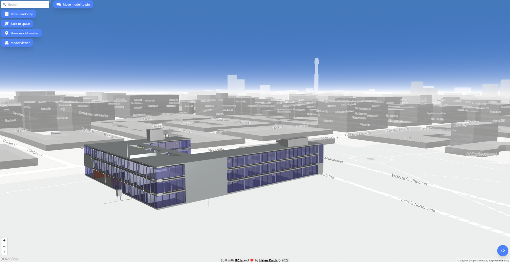

# bim-gis-viewer


Try it out: [https://extraordinary-belekoy-ee7fa8.netlify.app](https://extraordinary-belekoy-ee7fa8.netlify.app)

 
## Key Features

- Place your model anywhere you want or move it randomly (BIM-GIS integration)
- Support 3D measurement
- Read IFC properties by clicking elements
- Add clipping planes to find internal elements
- Change background color of the viewer with a color palette
- Preprocessing, memory management and multithreading support

## How To Use

Get a free Mapbox API Key at [https://www.mapbox.com/](https://www.mapbox.com/)

```bash
# Clone this repository
$ git clone https://github.com/bibinprathap/citygeo.git

# Go into the repository
$ cd citygeo

# Install dependencies
$ npm install

# Run Rollup
$ npm run build
```

Store your API in .env and Use [Live Server](https://marketplace.visualstudio.com/items?itemName=ritwickdey.LiveServer) to serve the app

## Credits

This software uses the following open source packages:

- [IFC.js](https://ifcjs.github.io/info/)
- [Three.js](https://threejs.org/)
- [Mapbox GL JS](https://www.mapbox.com/mapbox-gljs)
- [Node.js](https://nodejs.org/)
- [Nodemon](https://nodemon.io/)
- [Dexie.js](https://dexie.org/)
- [Rollup](https://rollupjs.org/guide/en/)
- [Dotenv](https://dotenv.org/)


https://github.com/outer-labs/react-forge-viewer

https://github.com/lucascassiano/react-cubeview

React Native + Forge
https://github.com/wallabyway/forgeApp

https://github.com/dmh126/react-adsk-forge-viewer-ts


https://github.com/JoostGevaert/ifcjs-gis

Autodesk Forge IoT Real-Time Sample with React & FeathersJS
https://github.com/dukedhx/viewer-iot-react-feathersjs


React Typescript wrapper for Autodesk Forge Viewer
https://github.com/dmh126/react-adsk-forge-viewer-ts


https://github.com/bernatsampera/Forge-React-Viewer

https://github.com/jakubGryzio/BIMtoGIS

Python for street networks. Download, model, analyze, and visualize street networks and other geospatial features from OpenStreetMap.
https://github.com/gboeing/osmnx


https://github.com/vvoovv/blosm


https://github.com/LemiCandy/Terrain-textures-for-OSM2CITY


https://github.com/visgl/deck.gl

https://github.com/supermedium/three.js


https://github.com/storytellingmap/storymap


https://jsfiddle.net/o50vy8jc/

flavio-bernasconi/mapbox-react (github.com)


https://github.com/storytellingmap/storymap
